# root@meowmet:~# whoami

  
   
   
  

 

### `$ cat profile.txt`

> ⚙️ **AI Systems Engineering:** Architecting **AgenticVMM**, an O(1) distributed memory engine for Edge AI (Microsoft Capstone).
> 🔬 **AGI Research:** Creator of the **SymboLang** benchmark, exposing syntax drift and executive function failures in frontier LLMs.
> 🛡️ **Offensive Security:** Discovering real-world zero-day vulnerabilities (e.g., PixVerse BAC) and bypassing access controls.
> 🎓 4th-year Computer Engineering Student. Bridging hardware-level AI architecture and offensive security.
> 🌐 Access: [meowmet.github.io](https://meowmet.github.io/)

### `$ ls -projects`

| Project | Description | Stack | Status |
| :--- | :--- | :--- | :--- |
| **AgenticVMM** | O(1) distributed memory engine for KV-cache pointer cloning. | `C++`, `llama.cpp` | Microsoft Capstone |
| **SymboLang** | Synthetic language benchmark for measuring LLM logic degradation. | `Python`, `NLP` | Published |
| **PixVerse BAC** | Critical Broken Access Control discovery on production. | `Web Security` | Zero-Day |
| **FASPA** | Fast and Secure Personal Assistant with AES-encryption. | `C++`, `Local AI` | Open Source |
| **Bahasakedi** | Bilingual Turkish-Indonesian language learning platform. | `Web`, `Content` | Active |

### `$ fetch --capabilities`

> 🛡️ **Security:** Top 1% Global TryHackMe | Zero-Day Vulnerability Researcher
> ⚙️ **Engineering:** Low-level AI Optimization | C-API | Distributed Systems
> 🔬 **Research:** Published "The Reasoner's Dilemma" on AGI Cognitive Frameworks
> 🏢 **Industry:** Microsoft AI Innovators Internship
> 🎯 **Status:** Architecting enterprise-scale edge AI systems and hunting zero-days.

 

  <a href="https://meowmet.github.io/">Portfolio</a> &nbsp;&nbsp;•&nbsp;&nbsp; 
  <a href="https://www.linkedin.com/in/mehmet-nuri-erkan-97b024347/">LinkedIn</a> &nbsp;&nbsp;•&nbsp;&nbsp; 
  <a href="https://tryhackme.com/p/meowmet">TryHackMe</a> &nbsp;&nbsp;•&nbsp;&nbsp; 
  <a href="https://t.me/miyavmet">Telegram</a> &nbsp;&nbsp;•&nbsp;&nbsp; 
  <a href="https://medium.com/@meowmetnuwri">Medium</a>

